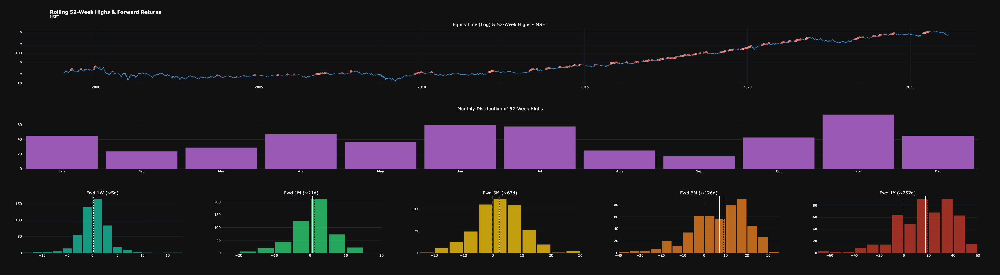
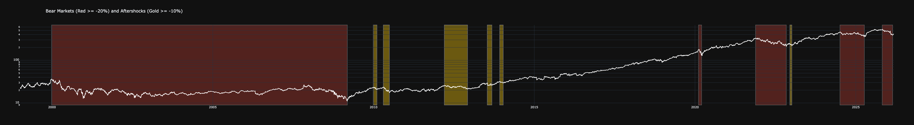
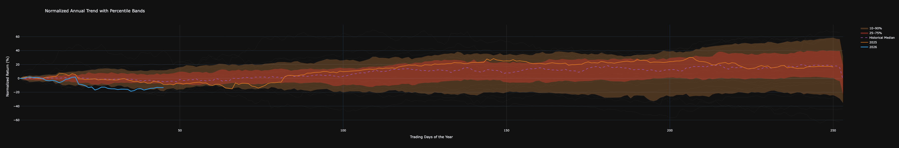

# Quantitative Equity Analysis & Market Regime Dashboard

This repository contains a **professional-grade quantitative analysis toolkit developed in Python**.  
The project focuses on identifying **statistical edges in stock market data** through the analysis of **price action, historical drawdowns, and seasonal patterns**.

---

## Core Features

### 1. Highs & Forward Returns Analysis

This module identifies **52-week highs (252 trading days)** and performs a statistical analysis on subsequent price action.  
It calculates the probability of **trend continuation** by analyzing **forward returns across multiple time horizons (20, 60, and 120 days)**.

**Key Metric:**  
- Frequency of **"Breakout vs. Fakeout"**

**Visual Insight:**  
The chart below displays the historical relationship between hitting a **new yearly high** and the **expected magnitude of future gains**.

---

### 2. Bear Market & Recovery Profiling

A deep-dive algorithm designed to detect **"Bear Market" regimes**, defined as a **peak-to-trough decline of 20% or more**.

The analysis goes beyond simple detection, calculating:

- **Time to Bottom:** Duration of the crash phase  
- **Recovery Velocity:** Time required to break even *(return to previous ATH)*  
- **Secondary Drawdowns:** Volatility clusters during the recovery phase  

---

### 3. Seasonality & Percentile Confidence Bands

This section provides a **normalized view of annual performance**.

By aligning every historical year to a common starting point (**Base 0**), the model calculates the **median path** and defines statistical **"normalcy"** using percentile bands:

- 10th percentile  
- 25th percentile  
- 75th percentile  
- 90th percentile  

**Applications**

**Alpha Generation:**  
Identifies months where the stock consistently **outperforms or underperforms the median**.

**Risk Management:**  
Highlights periods where price action **deviates significantly from the 90th percentile**, signaling potential **mean reversion**.

---

## Tech Stack

- **Data Sourcing:** `yfinance` — real-time and historical market data  
- **Computation:** `Pandas` & `NumPy` for vectorized time-series operations  
- **Statistics:** `Statsmodels` & `SciPy` for ARIMA modeling and hypothesis testing  
- **Visualization:** `Plotly` for interactive, publication-quality charts
